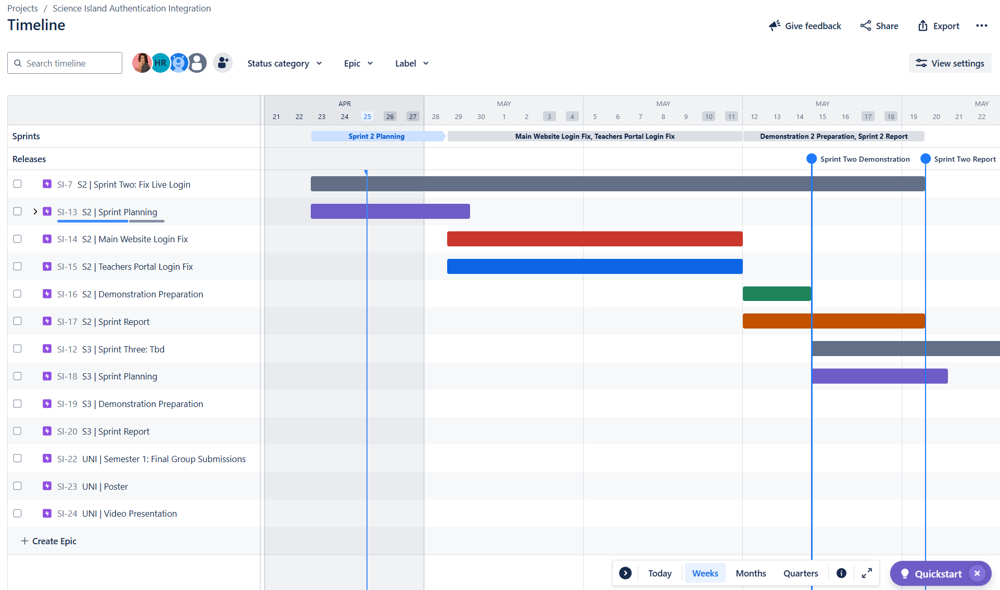
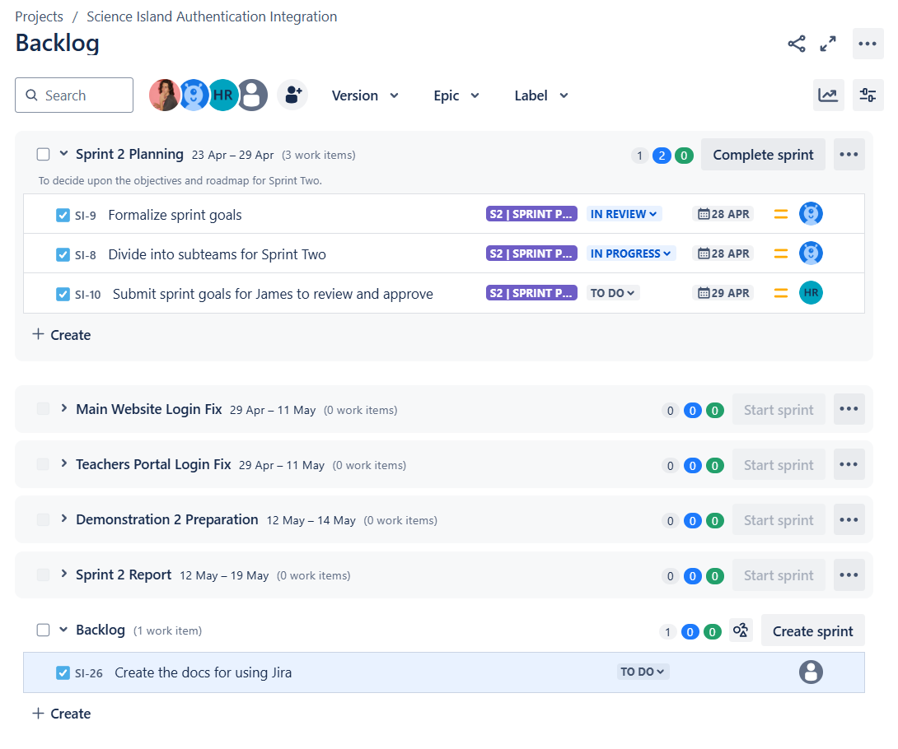
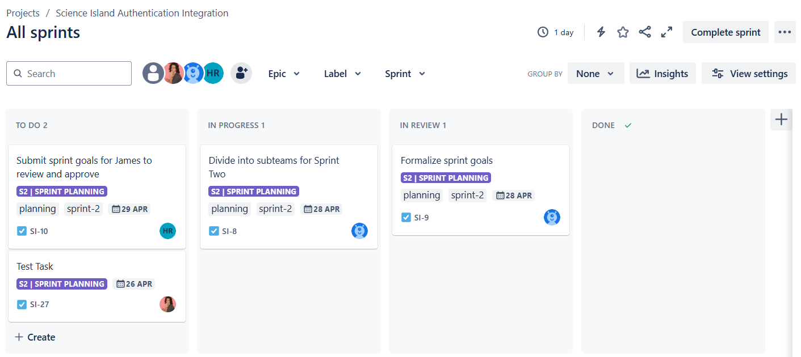

I think that we can all agree that **GitHub Project Boards** aren't the most intuitive thing in the world. Going in to Sprint Two, where having a clear way to plan and track tasks will become more important, we'll be making the change to **Jira** to help keep things organized.

This blog provides instructions and best practices for contributing to our new project board to ensure that it stays neat and useful throughout the remainder of the project.

<!--truncate-->

## The Basics

### Design Philosophy

- **Simplicity**: This time around we are starting with the minimum viable implementation. That means that things like connecting to GitHub Issues won't be included here.
- **Readability**: The default for all decisions is whatever makes things easier to read and understand.

### Terminology

- **Sprint**: Refers to the 3-week blocks that the university has assigned for us.
- **Sub-Sprint**: Refers to the smaller groups of tasks that occur within each Sprint (E.g., planning, demonstration preparation, etc).
- **Task**: Refers to a single, actionable item that contributes to the completion of a sub-sprint. Tasks should be specific, measurable, and achievable within the sprint duration.

## Timeline

The timeline is our main view for an overview of how everything fits together. You can expand each sub-sprint to see the tasks. The timeline looks best when set to `Weeks` view.

> *This sections is primarily used for viewing tasks. To keep things consistent, only the `site admin` should be editing things here.*

### Colour Chart

| Colour                    | Meaning |
| ------------------------- | ------- |
| Dark Grey                 | Represents the Sprint. This is used purely to visualize the duration of each sprint. No tasks should be assigned to this Epic. |
| Dark Purple               | Sprint Planning. |
| Dark Green                | Demonstration Preparation. |
| Dark Orange (Dark Yellow) | Sprint Retrospective and Report Writing. |
| Anything Else             | Non-Recurring Sub-Sprints. |

> *Note: We use the Dark Grey Epics to show the sprint durations because the free version of Jira doesn't allow for the three layers that we need to represent [ Sprint / Sub-Sprint / Task ].*

## Backlog

This is where we create and manage all the tasks.

### Add Task

Tasks represent small activities that need to be completed as part of a sub-sprint.

To add a task to the project board, follow these steps.

1. **Expand the sprint you want to add a task to.**
    - If an appropriate sprint hasn't been created yet, add the task to `Backlog`.
2. **Click `+ Create`.**
3. **Write a description of the task and click enter.**
    - Keep task descriptions under 80 characters long.
4. **Click on the newly created task.**
   - A side panel will open for you to add further details.
5. **Add the following information.**
   - `Description` (if required).
   - `Assignee` (if already assigned).
   - `Labels` (always include the sprint, or `uni-specific` if it is not tied to a sprint.)
   - `Parent`
   - `Due Date`.
   - *Note that all of these can be left blank if adding the task to `Backlog`.*

> *Tasks can be added by anyone at any time.*

### Add Sub-Sprint

Sub-Sprints represent groupings of work that fall under a high-level sprint (*Dark Grey Epic*).

To add a sub-sprint to the project board, follow these steps.

1. **Click `Create Sprint`.**
2. **Click the `Pencil Icon` on the newly created sprint.**
3. **Fill in all fields and click `Update`.**

> *Sprints should be added by the `site admin` after consultation with the team.*

## Board

All tasks in **active sprints** will be shown here. You can filter tasks via the features in the top bar above the board.

### Tracking Progress

Each team member is expected to update the board by dragging tasks to the appropriate column as they go. Staying on top of task tracking is important for recording progress and ensuring that everyone is on the same page.

Team members are encouraged to remind each other to update the board where they notice that tasks are out-of-date.

## Releases

Jira doesn't have a proper way to add milestone markers to the timeline, so we use `releases` as a workaround.

To add a milestone marker, follow these steps.

1. Click `Create version`.
2. Add the following fields:
   - `Name`
   - `Start Date` & `Release Date` (these should be the same date).
   - `Description` (optional).
3. Navigate to the `Timeline` view.
4. Select the release, and click the `Highlight on timeline` checkbox.

> *Releases should be added by the `site admin` after consultation with the team.*