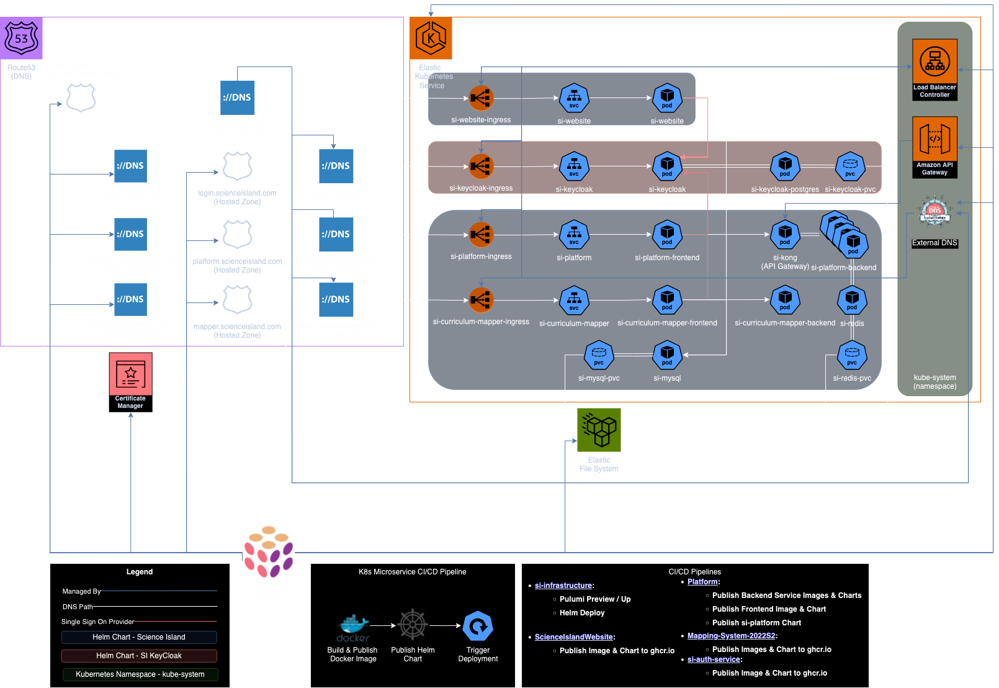

# Overview

Since its inception in 2014, Science Island has grown into a complex and expansive system, shaped by the contributions of over 1,000 developers. Over the years, multiple teams have worked on different aspects of the project, resulting in a rich tapestry of innovation, problem-solving, and technical evolution. The project has withstood shifting industry trends, varying development approaches, and the challenges inherent in long-term, large-scale software maintenance.

The purpose of this documentation is to provide a comprehensive guide to the project’s architecture, features, conventions, and development workflow. By consolidating a decade’s worth of development into a single, structured knowledge base, this resource aims to help developers quickly onboard, navigate the system with confidence, and focus their efforts on shaping the project's future rather than deciphering its past.

## Tools & Tech

| Name | Links | Notes |
|------|-------|-------|
| AWS | [Console / Sign-In](https://ap-southeast-2.console.aws.amazon.com/console) | Hosted on AWS |
| Pulumi | [Docs - Get started with Pulumi](https://www.pulumi.com/docs/iac/get-started/aws/) [Uses - si-infrastructure](https://github.com/EducationNetworkGroup/si-infrastructure/) | Immutable Infrastructure as Code |
| KeyCloak | [Docs - Container Docs](https://www.keycloak.org/nightly/server/containers) [Docs - Server Administration](https://www.keycloak.org/docs/latest/server_admin/index.html) [Uses - si-auth-service](https://github.com/EducationNetworkGroup/si-auth-service/) | Open-Source Identity Management |
| Docker | [Docs - Getting Started](https://docs.docker.com/get-started/) [Docs - Docker Compose Quickstart](https://docs.docker.com/compose/gettingstarted/) | A tool for containerization |
| Kubernetes (k8s) | [Docs - Learn Kubernetes Basics](https://kubernetes.io/docs/tutorials/kubernetes-basics/) [YouTube - Learn Kubernetes](https://www.youtube.com/playlist?list=PL2We04F3Y_43dAehLMT5GxJhtk3mJtkl5) | K8s via AWS EKS |

## High-Level Architecture

