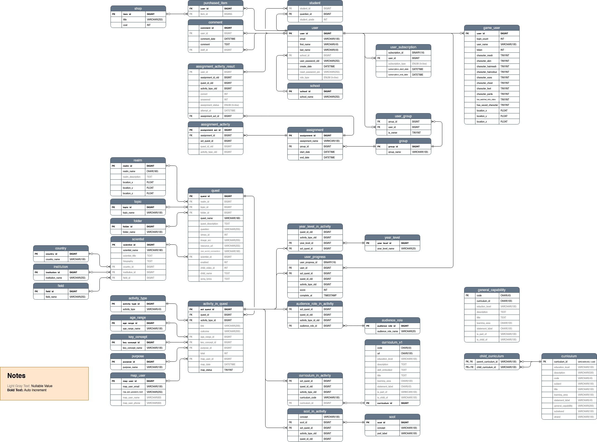

# Database

Science Island uses a MySQL databased named `allInOne.sql`, which stores data related to users, schools, progress and results, and game data. The database is essential for managing and synchronizing information across the mulitple applications in the Science Island project.

Copies of `allInOne.sql` can be found in the `Main Website / Game (ScienceIslandWebsite)` repository, the `Teacher's Portal (Platform)` repository, and the `Curriculum Mapper (Mappying-System-2022S2)` repository. Each of these applications uses the schema found in its own repository for local deployment. For live deployment, all applications use the version present in the `Teacher's Portal`.

Maintaining schema consistency across all instances of `allInOne.sql` is critical. Developers who make a change to the database's structure should ensure that change is applied across all repositories. 

## Entity-Relationship Diagram

The following ERD can be found in the `Teacher's Portal` repository, and can be editted using [draw.io](https://app.diagrams.net/?src=about). Ensure changes made to the structure of the database are reflected in the ERD.

## Key Tables

### User Tables

`allInOne` was initially created by combining three seperate databases from each aforementioned repository. Consequently, three user tables can be found in the schema.

| Table                         | Description                                                                                     |
| ----------------------------- | ----------------------------------------------------------------------------------------------- |
| `user`                        | Contains identifying information about the user, as well as information that assists in validating and authorizing a user logging in via KeyCloak. Every user (Student, Teacher or otherwise) should have an entry in the `user` table in order to login properly. |
| `game_user`                   | For users who require access to the `Science Island Game`. This table referrences an entry in the `user` table, and stores game-related information about the player (tokens earned, character customization, and whether or not the user has gone through the introduction yet). |
| `map_user`                    | Intended for users of the `Curriculum Mapper` application. |

### Game Data

The database contains static data used by the game to populate UI object and facilitate asset grabbing from GCP storage. Data in these tables should not be changed unless you've been specifically told to change it.

| Table                         | Description                                                                                     |
| ----------------------------- | ----------------------------------------------------------------------------------------------- |
| `realm`                       | Contains static data about the 10 realms in the game.                                    |
| `quest`                       | Contains static data about the various quests in the game, maps each quest to a realm, and contains links to assets found in GCP storage. |
| `activity_in_quest`           | Uses the `quest` and `activity_type` tables to define activities, and links to that activities assets in GCP storage. |
| `shop`                        | Contains static data about the upgrades to Science Island that users can purchase with tokens. | 

### Assignments

One of the core use cases in Science Island is the ability for a teacher to assign specific work to a group of students. The following tables facilitate that action:

| Table                         | Description                                                                                     |
| ----------------------------- | ----------------------------------------------------------------------------------------------- |
| `group`                       | Contains groups created by teachers. |
| `assignment`                  | Contains assignments created by teachers, and maps an entry from `group` to it. |
| `user_group`                  | Maps an entry from `user` to an entry from `group`, adding that user to the group. | 
| `assignment_activity`         | Maps an activity from `activity_in_quest` to an `assignment`, adding that activity to the assignment. |

### User Progress

| Table                         | Description                                                                                     |
| ----------------------------- | ----------------------------------------------------------------------------------------------- |
| `assignment_activity_result`  | Tracks what activities in `assignment_activity` have been completed by a `user`. |
| `user_progress`               | Tracks what activities in `activity_in_quest` have been completed by a `user`. |
| `purchased_item`              | Tracks what items from `shop` have been purchased by a `user`. |